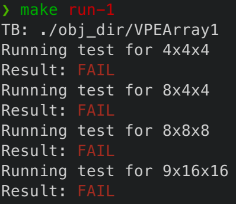
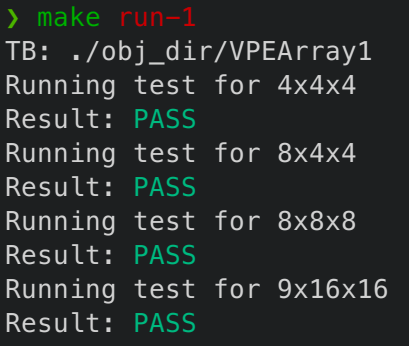

# Homework 3: Systolic Array

> **DDL: 2023.12.13 23:59.** 请将作业提交到**服务器指定位置**
> 
> 本次作业包含 2 个问题，请独立完成

## 问题描述

针对 GEMM $Y(i,j)\mathrel{+}=A(i,k)\times B(k,j)$

请分别依照以下两个问题中的 STT，使用 Chisel 完成 PEArray 模块。

| **Problem 1 STT**                                   | **Problem 2 STT**                                   |
|:---------------------------------------------------:|:---------------------------------------------------:|
| $T=\begin{bmatrix}0&1&0\\0&0&1\\1&1&1\end{bmatrix}$ | $T=\begin{bmatrix}1&0&0\\0&0&1\\0&1&0\end{bmatrix}$ |

其中，模块名都为 PEArray，但分别写在两个不同的文件（PEArray1，PEArray2）中，且package名不同。

PE Array 的大小为 $4\times4$

**参数：** `dtype` 数据类型

**输入：**

* `logic [3:0] [7:0] a_in`，Tensor A 的输入
* `logic [3:0] [7:0] b_in`，Tensor B 的输入
* `logic [3:0] [7:0] c_in`，Tensor C 的部分和
* `logic stationaryCtrl` ， 当 stationaryCtrl 为 `1` 时，从对应的输入通道载入数据，否则保持 stationary。有且仅有一个 Tensor 的 reuse 类型是 stationary，这个控制信号用于控制其数据载入(和移出，如果是输出张量)。

**输出：**

* `logic [3:0] [7:0] c_out`，Tensor C  的输出

其中，输入输出 Vec 的方向与 STT 映射之后的方向一致，例如：假设 Tensor A 沿着 x 轴正方向 systolic，那么 a_in(0) 从 PE(0,0) 进入，a_in(1) 从 PE(0,1) 进入，以此类推。**对于 Stationary 的，如果沿着 y 轴正方向传递，输入的 PE 为 PE(0,0)，PE(1,0)，... 以此类推；如果沿着 x 轴正方向传递，输入的 PE 为 PE(0,0), PE(0,1), ... 以此类推。Problem 1 中 Stationary Tensor 沿 y 轴正方向传递，Problem 2 中 Stationary Tensor 沿 x 轴正方向传递。**

除了代码之外，需要提供一份简单的报告，报告内容包括：

* 三个张量各自的 reuse 类型和方向 （包括计算过程）
* PE 内部结构，以及 PE Array 设计的大致描述

无法实现代码时，助教会根据报告酌情给分。

## 下发文件

```
hw03-systolic
├── common.h
├── gold-wave
├── Makefile
├── PEArray1.sv
├── PEArray1_tb.cpp
├── PEArray2.sv
├── PEArray2_tb.cpp
├── README.md
└── README.pdf
```

其中，`PEArray1.sv` 和 `PEArray2.sv` 中定义了基本的模块名字和 IO 接口。你需要实现 systolic array 的具体功能。

你可以用命令 `make run-1`，`make run-2` 来分别运行 PEArray1 和 PEArray2，下面展示了正常情况下的命令输出： 

<div style='display: flex; justify-content: space-around'>


</div>

数据的输入、输出方式可以看对应的 `tb.cpp` 文件，你可以将 `common.h` 文件中，`verbose` 设置为 `true` 来打印输入输出的矩阵。

```c++
#include "verilated.h"
#include "verilated_vcd_c.h"

std::string tb_name;
bool verbose = false; // change to true

void init_ctx(int argc, char** argv) {
    tb_name = argv[0];
```

不管是否正确，每次运行都会在 `obj_dir` 里生成 `trace` 文件，你可以观察波形来 debug。`gold-wave` 文件夹内有一些参考波形，可以模仿里面的时序顺序。

## 作业提交

请提交到 `/root/handin/hw3` 目录，保证 `/root/handin/hw3/PEArray1.sv` 和 `/root/handin/hw3/PEArray2.sv` 两个文件都存在。