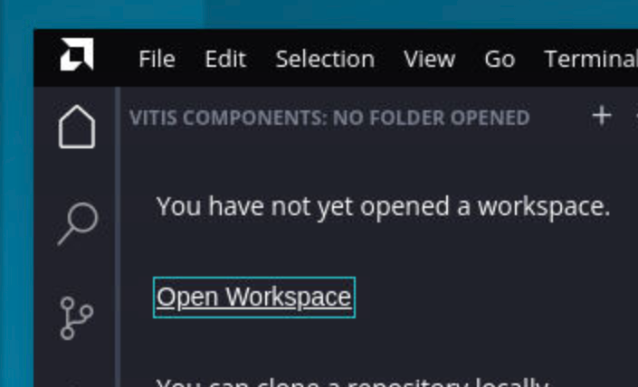
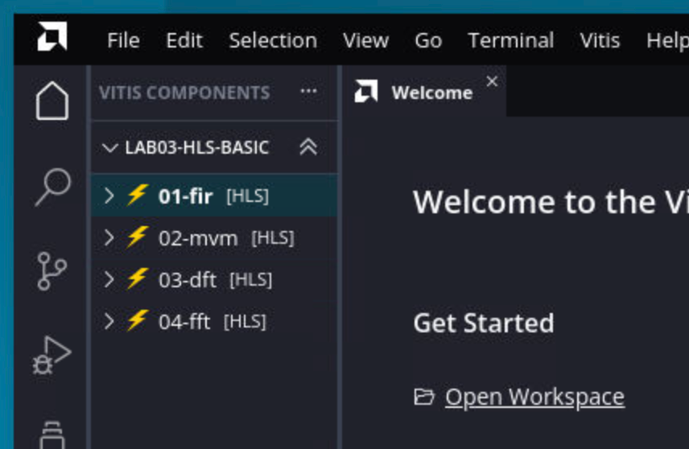

# Vitis 24 简要使用方法

先把 hanout 拷贝到自己的目录，

请打开 vitis 2024.1 后，选择 `Open Workspace`，然后打开 `lab03-hls-basic` 就行，里面会出现四个 repo

# Patch

1. 02-mvm, 需要设置输入 port 的 bundle，保证两次内存读在两个不同的 bundle 上，这样内存读可以同时进行
2. 03-dft，用三目运算符放置 exp 在同一个周期内的数据依赖
3. 04-fft，同 02-mvm，需要设置 bundle